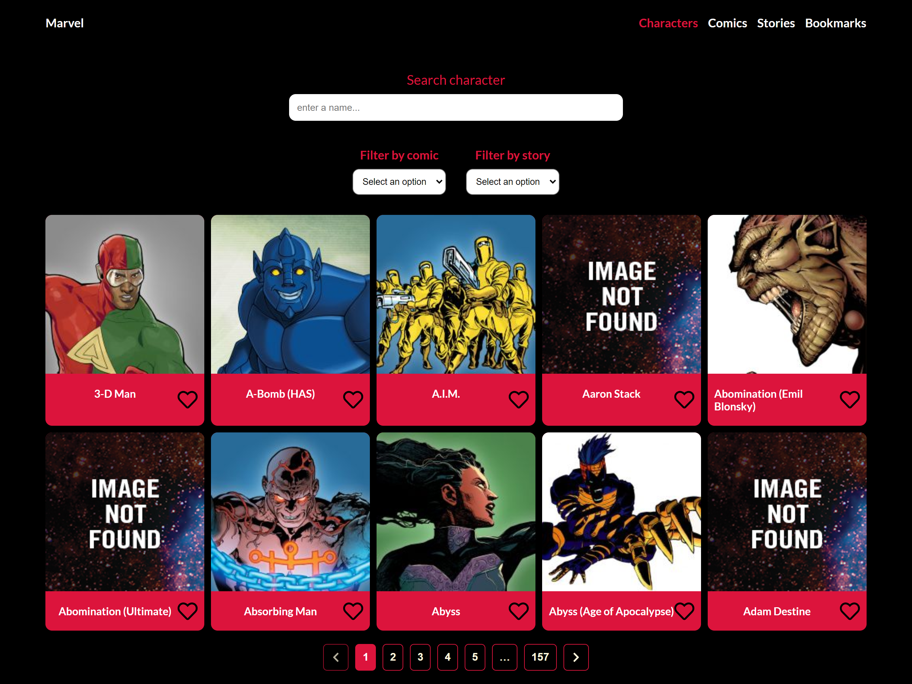
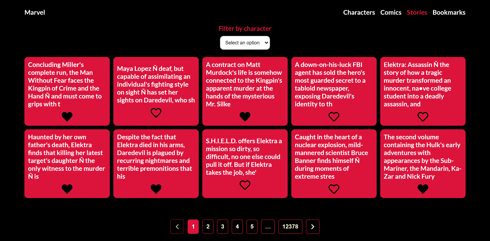
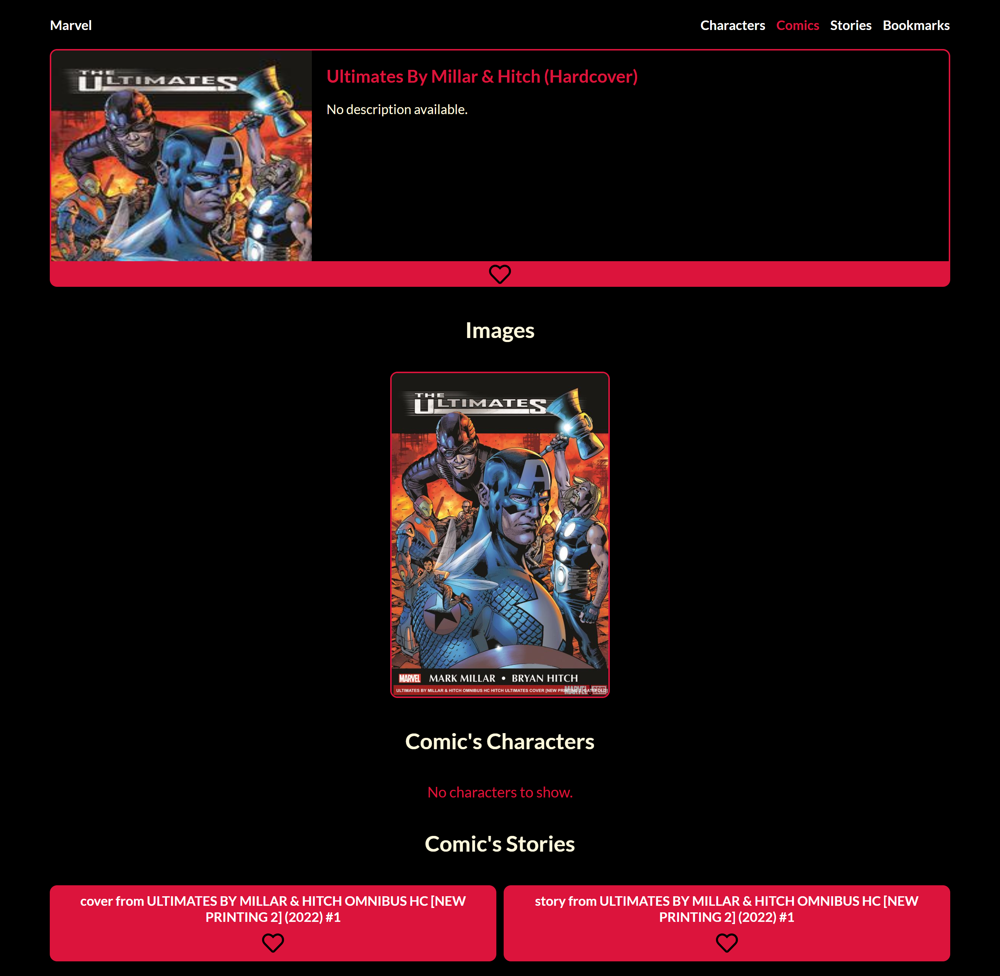

# Homework Week 8

## Description

The project consist of consuming the Marvel API and create pages to show the master/detail of the Characters, Comics and Stories resources. Add filtering functionality in every resource displayed and the possibility to bookmark/unbookmark every resource item, as well as the possibility to hide/expose every resource item from all pages.

## Live Site

[Vercel Deployment](https://homework-week-8.vercel.app/)

## Built With

- Semantic HTML5 markup
- CSS Flexbox
- CSS Grid
- Desktop-First approach
- Sass / Scss
- React JS
- React Router
- React Hooks / Custom Hooks
- Redux
- react-icons
- react-spinner
- TypeScript

## Visuals

**Screenshots Desktop #1**

**Screenshots Desktop #2**

**Screenshots Desktop #3**

**Screenshots Desktop #4**

**Screenshots Desktop #5**

**Screenshots Desktop #6**

